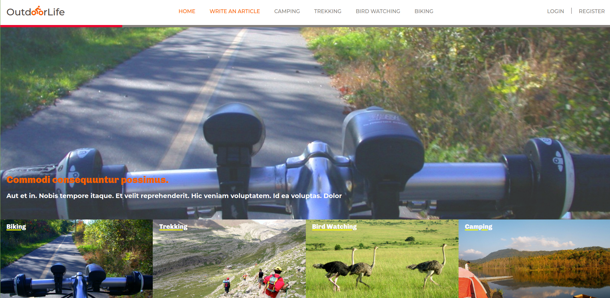

# :bike: Outdoor Blog

> A desktop app where users can create articles about outdoor life (biking, trekking, camping, bird watching), browse categories and vote for posts.
>  Join the adventure! :sunrise_over_mountains: :beetle: 



## Built With

- Ruby v3.0.0
- Ruby on Rails v6.x


## Live Demo

Check the [live version](https://warm-earth-97805.herokuapp.com/) of the app!


## Getting Started

To get a local copy up and running follow these simple example steps.

### Prerequisites

- Ruby on Rails v6.x. To learn how to install Ruby on Rails, please follow this [link](https://guides.rubyonrails.org/getting_started.html)
- Postgres

### Setup

- Clone this repository using the link above (click on the 'code' button)
- open a terminal and `cd` to the cloned repository
- run `bundle install` to install the dependencies
* Warning: Because I created the 'Category' model last, migrations must be performed in this order, otherwise they will fail:
- run `rails db:create`
- run `rails db:migrate VERSION=20210322193213`
- run `rails db:migrate` to migrate the rest of the database
- run `rails db:seed`
- start a server with `rails s`

### Usage

- start a server with `rails s`

- open `http://localhost:3000/` in your browser.

- Sign up with just your name to start writing articles, browse categories and vote other users' posts


### Run tests

```
    rpsec -fd
```

### Deployment

- Deployed in Heroku

## Authors

👤 **Alicia Rojas**

- GitHub: [@aliciapaz](https://github.com/aliciapaz)
- Twitter: [@_alicia_paz](https://twitter.com/_alicia_paz)
- LinkedIn: [Alicia Rojas](https://www.linkedin.com/in/aliciapazrojas/)


## 🤝 Contributing

Contributions, issues and feature requests are welcome!

Feel free to check the [issues page](https://github.com/aliciapaz/outdoor-blog/issues).

## Show your support

Give a ⭐️ if you like this project!

## Acknowledgments

- Design idea by [Nelson Sakwa on Behance](https://www.behance.net/sakwadesignstudio)
- Microverse TSE [SpayCo](https://github.com/Spayco) for helping me with debugging

## 📝 License

This project is [MIT](LICENSE) licensed.